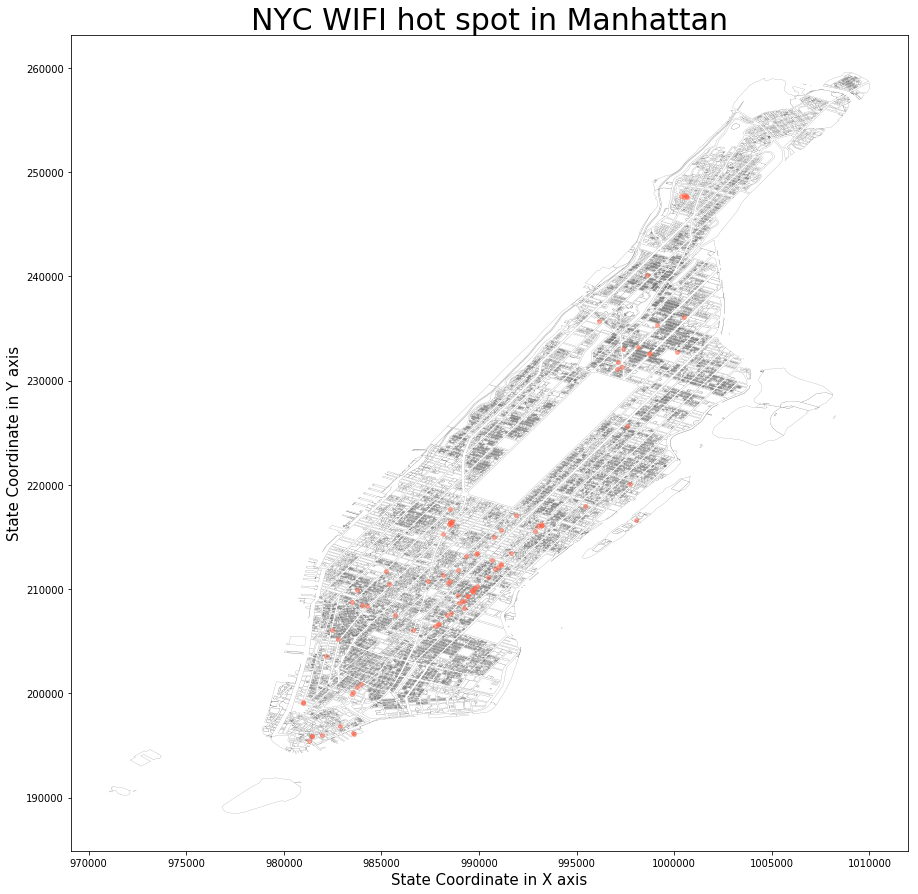

Plot Review:

Plot:

Review:

CLARITY: 

Title&Caption

I assume the couple of lines on top of the plot is your caption. So what is the defination of WIFI hotspot? I guess you are talking about new york city public wifi access points - LINKNYC program?  Or is it some other commercial/residential hotspots? We will need more guidance on what we are looking at. 

Also by 'each transperated red dot is WIFI location and darker means more than one WIFI spot is located on the map', you mean transparent or lighter red color? And the word 'draker' can be confusing, some locations looks like there is a cluster of dots, but the color difference is not that much. I suggest you use more red color not tomato red and bigger aphla value.

# FBB good point - red on gray acrivates preattentiveness though

Do we have total quantity of these hotspots? Do we want to provide that information? What is coverage capacity and coverage range of these hotspots? These might be some information reader want when read the plot, what do you think?

Any reason we are using state coordinates for x and y axises? Or do we need coordinates for the plot, can a street map do the work? And probably use some other base maps with better view of street information is easier for people to understand where these spots are.

# FBB uf you use state coordinates you are using a dimentional quantity, so you need units (ft)

ESTHETIC: 

The base map is nicely fit into the plot. And the plot generally allows me to focus on the red dots. And the color is good, reader won't miss them.
But the low definition of the map gives me some hardtime to read the spots information such as where they are.

# FBB good

Like state in the previous paragraphy, we can improve the readability by using a different base map: instead using white for streets and black for blocks, we can reverse it and use black for streets and white for blocks.  

Also the dots' size can be tricky, you might want to make a note to clearify. Does the size mean coverage range? If not, they expand over one or two streets, what is the exact location? 

HONESTY: 

Depends on what is the purpose of the plot, if we just want to show we have some hotspots in the city and their approximately locatoins, this plot is fit, still don't really need coordinates though. If we want to show which streets they are at, and how many of them, the plot might need some improvement changes.
Not sure how we overlay the dots to the base map, by state coordinates? That is why we are using this base map?
You can make some clearification.

10/10

